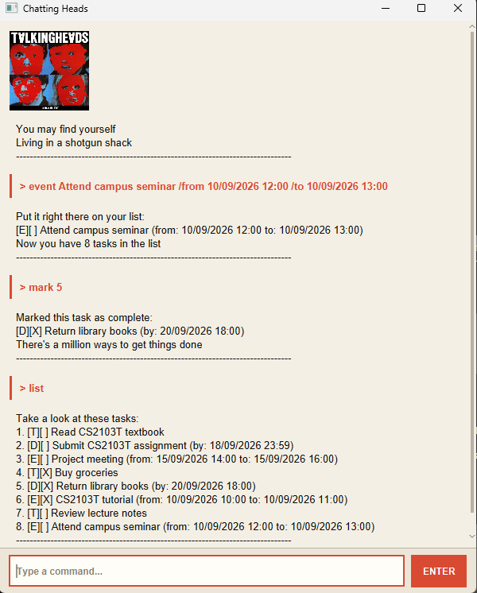

# Chatting Heads User Guide

Chatting Heads is a desktop task manager that helps you keep track of todos,
deadlines, and events using simple text commands.

## Quick start

Type a command into the text box at the bottom of the window and press
**ENTER** or the Enter key.

Dates and times must use the format:

`dd/MM/yyyy HH:mm`

For example: `18/09/2026 23:59`.

## Adding a todo

Adds a task without a specific date or time.

**Format:**

`todo DESCRIPTION`

**Example:**

`todo Read CS2103T textbook`

## Adding a deadline

Adds a task that must be completed by a particular date and time.

**Format:**

`deadline DESCRIPTION /by DATE_TIME`

**Example:**

`deadline Submit CS2103T assignment /by 18/09/2026 23:59`

## Adding an event

Adds a task that takes place between a start and end time.

**Format:**

`event DESCRIPTION /from START_DATE_TIME /to END_DATE_TIME`

**Example:**

`event Project meeting /from 15/09/2026 14:00 /to 15/09/2026 16:00`

The end time must be after the start time.

## Listing tasks

Displays all tasks and their task numbers.

**Format:**

`list`

Task numbers shown by `list` are used by commands such as `mark`, `unmark`,
`delete`, and `reschedule`.

## Finding tasks

Displays tasks whose descriptions contain the specified keyword.

**Format:**

`find KEYWORD`

**Example:**

`find project`

## Marking a task as complete

Marks the specified task as completed.

**Format:**

`mark TASK_NUMBER`

**Example:**

`mark 2`

## Marking a task as incomplete

Marks the specified task as incomplete again.

**Format:**

`unmark TASK_NUMBER`

**Example:**

`unmark 2`

## Deleting a task

Deletes the specified task.

**Format:**

`delete TASK_NUMBER`

**Example:**

`delete 3`

## Rescheduling a deadline

Changes the date and time of an existing deadline.

**Format:**

`reschedule TASK_NUMBER /by DATE_TIME`

**Example:**

`reschedule 2 /by 20/09/2026 23:59`

The selected task must be a deadline.

## Rescheduling an event

Changes the start and end times of an existing event.

**Format:**

`reschedule TASK_NUMBER /from START_DATE_TIME /to END_DATE_TIME`

**Example:**

`reschedule 3 /from 16/09/2026 15:00 /to 16/09/2026 17:00`

The selected task must be an event, and the new end time must be after the
new start time.

## Exiting Chatting Heads

Closes the application.

**Format:**

`bye`

## Command summary

| Action | Command |
| --- | --- |
| Add todo | `todo DESCRIPTION` |
| Add deadline | `deadline DESCRIPTION /by DATE_TIME` |
| Add event | `event DESCRIPTION /from START_DATE_TIME /to END_DATE_TIME` |
| List tasks | `list` |
| Find tasks | `find KEYWORD` |
| Mark task | `mark TASK_NUMBER` |
| Unmark task | `unmark TASK_NUMBER` |
| Delete task | `delete TASK_NUMBER` |
| Reschedule deadline | `reschedule TASK_NUMBER /by DATE_TIME` |
| Reschedule event | `reschedule TASK_NUMBER /from START_DATE_TIME /to END_DATE_TIME` |
| Exit | `bye` |
